# SparkStreaming & SparkSql

## 1、项目介绍
&emsp;&emsp;Spark 是一种基于内存的快速、通用、可扩展的大数据分析计算引擎。
  
&emsp;&emsp;本项目学习内容：
* SparkStreaming详解
* SparkStreaming案例（状态管理、窗口计算、topN、数据持久化）
* SparkStreaming整合Kafka
* SparkSql详解  
* SparkSql案例（加载数据成为分布式表、将RDD转为DataFrame、RDD-DF-DS相互转换、SparkSQL花式查询、实现WordCount、多数据源支持、电影数据分析、SparkSQL-UDF）
* SparkOnHive（SparkSQL整合Hive）
* Spark分布式SQL引擎

&emsp;&emsp;本项目属于《Spark系列》：  
* [《Spark环境搭建》](https://github.com/xiaoguangbiao-github/bigdata_spark_env.git)  
* [《Spark内核原理及RDD》](https://github.com/xiaoguangbiao-github/bigdata_spark_core.git)  
* [《SparkStreaming & SparkSql》](https://github.com/xiaoguangbiao-github/bigdata_sparkstreaming_sparksql.git)  
* [《StructuredStreaming & Spark综合案例》](https://github.com/xiaoguangbiao-github/bigdata_structuredstreaming_sparkdemo.git)
* [《Spark3.0新特性 & Spark多语言开发》](https://github.com/xiaoguangbiao-github/bigdata_spark3_languagedevelop.git)


## 2、开发环境

- 语言：scala 2.12.11

- Eclipse/IDEA

- 依赖管理：Maven

- Spark 3.0 + hadoop 2.7


# SparkStreaming引入

## 流式计算应用场景

1.实时大屏

2.实时监控

3.实时风控

4.实时流式数据统计分析

.....


## 流式计算处理模式

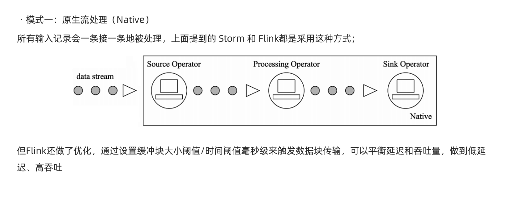


https://haokan.baidu.com/v?vid=3184290770425607225&pd=bjh&fr=bjhauthor&type=video


## SparkStreaming介绍

- 官方定义


- SparkStreaming在Spark框架中的位置

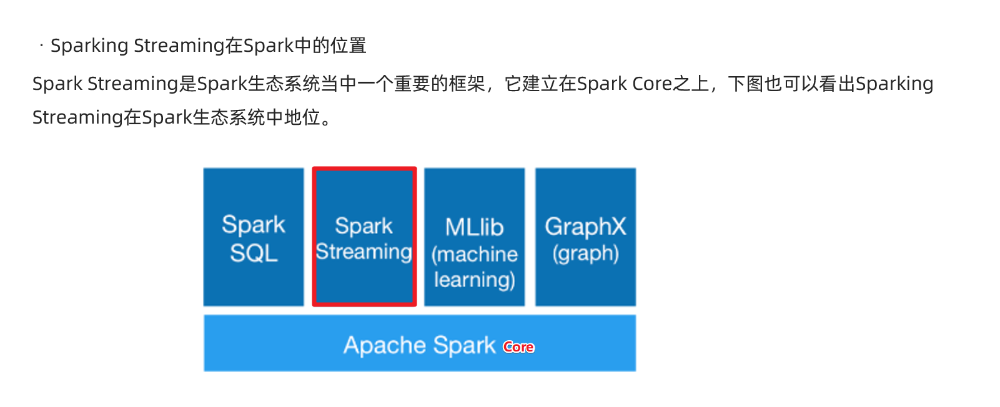

- 特点


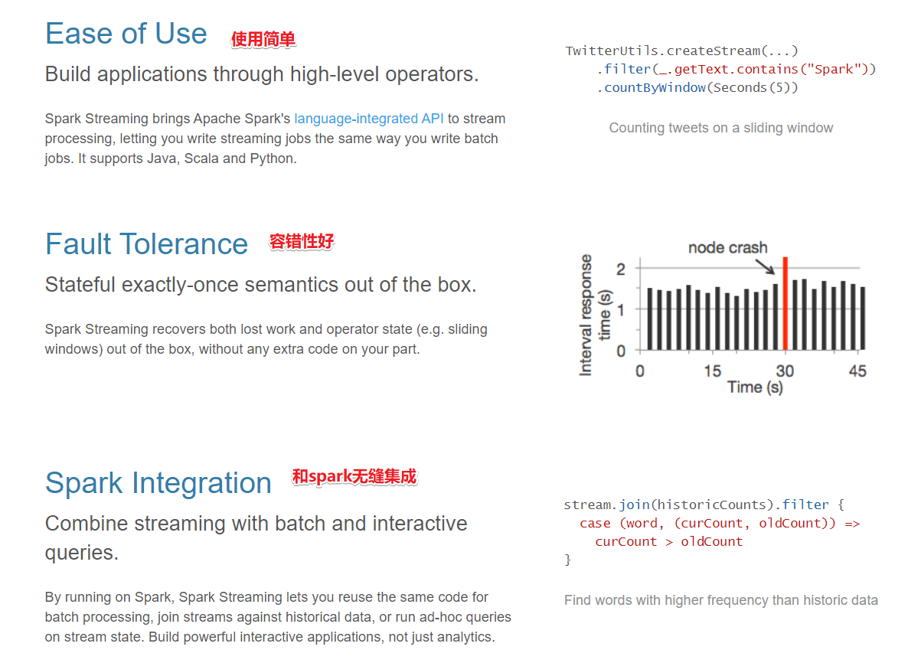

- 数据处理流程

  Kafka--->SparkStreaming-->各种存储组件


- 核心计算思想


# SparkStreaming数据抽象

## DStream的本质

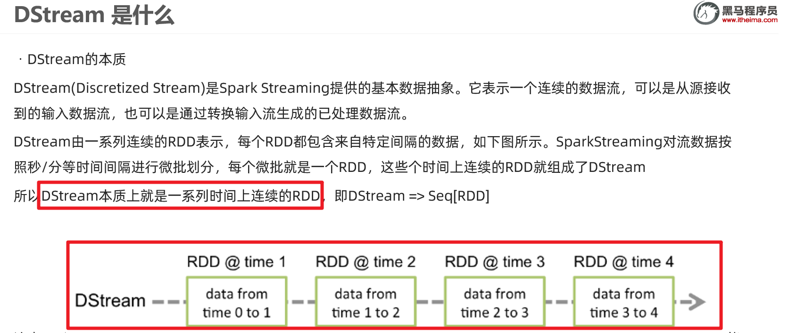


## 对DStream进行操作


## DSteam的容错


## DSteam的API

大多数Transformation和Action/Output和 之前的RDD的一样使用, 少部分不一样的通过案例讲解


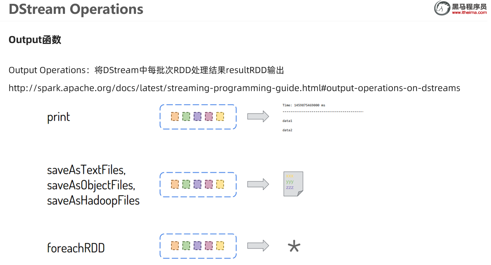


# SparkStreaming案例


##  案例1-WordCount


yum install -y nc

https://github.com/apache/spark/blob/master/examples/src/main/scala/org/apache/spark/examples/streaming/NetworkWordCount.scala

```Java
package cn.xiaoguangbiao.streaming

import org.apache.spark.streaming.dstream.{DStream, ReceiverInputDStream}
import org.apache.spark.{SparkConf, SparkContext, streaming}
import org.apache.spark.streaming.{Seconds, StreamingContext}

/**
 * Author xiaoguangbiao
 * Desc 使用SparkStreaming接收node1:9999的数据并做WordCount
 */
object WordCount01 {
  def main(args: Array[String]): Unit = {
    //TODO 0.准备环境
    val conf: SparkConf = new SparkConf().setAppName("spark").setMaster("local[*]")
    val sc: SparkContext = new SparkContext(conf)
    sc.setLogLevel("WARN")
    //the time interval at which streaming data will be divided into batches
    val ssc: StreamingContext = new StreamingContext(sc,Seconds(5))//每隔5s划分一个批次

    //TODO 1.加载数据
    val lines: ReceiverInputDStream[String] = ssc.socketTextStream("node1",9999)

    //TODO 2.处理数据
    val resultDS: DStream[(String, Int)] = lines.flatMap(_.split(" "))
      .map((_, 1))
      .reduceByKey(_ + _)

    //TODO 3.输出结果
    resultDS.print()

    //TODO 4.启动并等待结束
    ssc.start()
    ssc.awaitTermination()//注意:流式应用程序启动之后需要一直运行等待手动停止/等待数据到来

    //TODO 5.关闭资源
    ssc.stop(stopSparkContext = true, stopGracefully = true)//优雅关闭
  }
}

```


## 案例2-状态管理

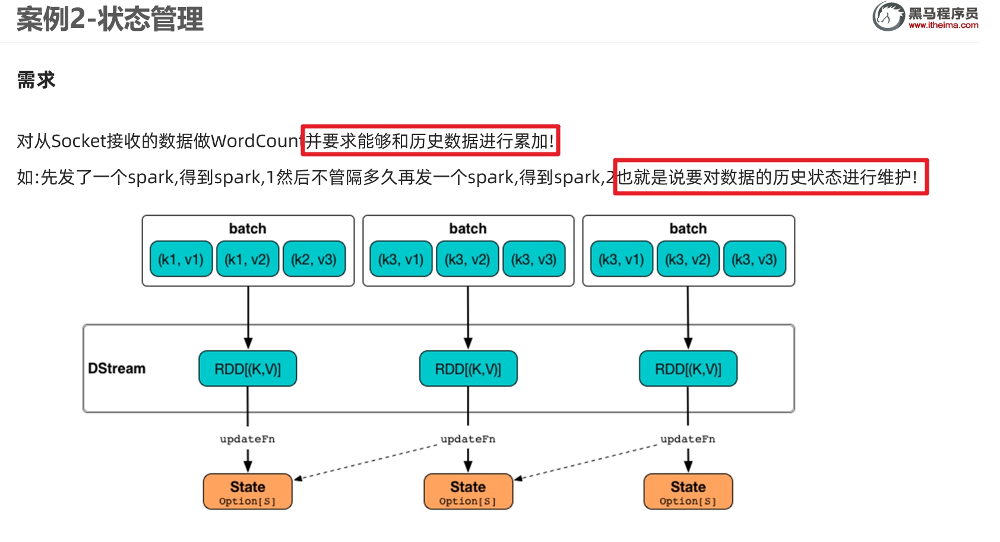


```Java
package cn.xiaoguangbiao.streaming

import org.apache.spark.streaming.dstream.{DStream, ReceiverInputDStream}
import org.apache.spark.streaming.{Seconds, StreamingContext}
import org.apache.spark.{SparkConf, SparkContext}

/**
 * Author xiaoguangbiao
 * Desc 使用SparkStreaming接收node1:9999的数据并做WordCount+实现状态管理:
 * 如输入spark hadoop 得到(spark,1),(hadoop,1)
 * 再下一个批次在输入 spark spark,得到(spark,3)
 */
object WordCount02 {
  def main(args: Array[String]): Unit = {
    //TODO 0.准备环境
    val conf: SparkConf = new SparkConf().setAppName("spark").setMaster("local[*]")
    val sc: SparkContext = new SparkContext(conf)
    sc.setLogLevel("WARN")
    //the time interval at which streaming data will be divided into batches
    val ssc: StreamingContext = new StreamingContext(sc, Seconds(5)) //每隔5s划分一个批次

    //The checkpoint directory has not been set. Please set it by StreamingContext.checkpoint().
    //注意:state存在checkpoint中
    ssc.checkpoint("./ckp")

    //TODO 1.加载数据
    val lines: ReceiverInputDStream[String] = ssc.socketTextStream("node1", 9999)

    //TODO 2.处理数据
    //定义一个函数用来处理状态:把当前数据和历史状态进行累加
    //currentValues:表示该key(如:spark)的当前批次的值,如:[1,1]
    //historyValue:表示该key(如:spark)的历史值,第一次是0,后面就是之前的累加值如1
    val updateFunc = (currentValues: Seq[Int], historyValue: Option[Int]) => {
      if (currentValues.size > 0) {
        val currentResult: Int = currentValues.sum + historyValue.getOrElse(0)
        Some(currentResult)
      } else {
        historyValue
      }
    }

    val resultDS: DStream[(String, Int)] = lines.flatMap(_.split(" "))
      .map((_, 1))
      //.reduceByKey(_ + _)
      // updateFunc: (Seq[V], Option[S]) => Option[S]
      .updateStateByKey(updateFunc)

    //TODO 3.输出结果
    resultDS.print()

    //TODO 4.启动并等待结束
    ssc.start()
    ssc.awaitTermination() //注意:流式应用程序启动之后需要一直运行等待手动停止/等待数据到来

    //TODO 5.关闭资源
    ssc.stop(stopSparkContext = true, stopGracefully = true) //优雅关闭
  }
}

```


## 案例3-状态恢复-扩展

```Java
package cn.xiaoguangbiao.streaming

import org.apache.spark.streaming.dstream.{DStream, ReceiverInputDStream}
import org.apache.spark.streaming.{Seconds, StreamingContext}
import org.apache.spark.{SparkConf, SparkContext}

/**
 * Author xiaoguangbiao
 * Desc 使用SparkStreaming接收node1:9999的数据并做WordCount+实现状态管理+状态恢复
 * 如输入spark hadoop 得到(spark,1),(hadoop,1)
 * 再下一个批次在输入 spark spark,得到(spark,3)
 */
object WordCount03 {
  def creatingFunc():StreamingContext ={
    //TODO 0.准备环境
    val conf: SparkConf = new SparkConf().setAppName("spark").setMaster("local[*]")
    val sc: SparkContext = new SparkContext(conf)
    sc.setLogLevel("WARN")
    //the time interval at which streaming data will be divided into batches
    val ssc: StreamingContext = new StreamingContext(sc, Seconds(5)) //每隔5s划分一个批次

    //The checkpoint directory has not been set. Please set it by StreamingContext.checkpoint().
    //注意:state存在checkpoint中
    ssc.checkpoint("./ckp")

    //TODO 1.加载数据
    val lines: ReceiverInputDStream[String] = ssc.socketTextStream("node1", 9999)

    //TODO 2.处理数据
    //定义一个函数用来处理状态:把当前数据和历史状态进行累加
    //currentValues:表示该key(如:spark)的当前批次的值,如:[1,1]
    //historyValue:表示该key(如:spark)的历史值,第一次是0,后面就是之前的累加值如1
    val updateFunc = (currentValues: Seq[Int], historyValue: Option[Int]) => {
      if (currentValues.size > 0) {
        val currentResult: Int = currentValues.sum + historyValue.getOrElse(0)
        Some(currentResult)
      } else {
        historyValue
      }
    }

    val resultDS: DStream[(String, Int)] = lines.flatMap(_.split(" "))
      .map((_, 1))
      //.reduceByKey(_ + _)
      // updateFunc: (Seq[V], Option[S]) => Option[S]
      .updateStateByKey(updateFunc)

    //TODO 3.输出结果
    resultDS.print()

    ssc
  }
  def main(args: Array[String]): Unit = {
    //TODO 0.准备环境
    val ssc: StreamingContext = StreamingContext.getOrCreate("./ckp", creatingFunc _)
    ssc.sparkContext.setLogLevel("WARN")

    //TODO 4.启动并等待结束
    ssc.start()
    ssc.awaitTermination() //注意:流式应用程序启动之后需要一直运行等待手动停止/等待数据到来

    //TODO 5.关闭资源
    ssc.stop(stopSparkContext = true, stopGracefully = true) //优雅关闭
  }
}

```


## 案例4-窗口计算


如实际开发中:

每隔1min计算最近24小时的热搜排行榜

每隔10s计算最近10分钟的广告点击量

每隔1h计算最近7天的热搜


```Java
package cn.xiaoguangbiao.streaming

import org.apache.spark.streaming.dstream.{DStream, ReceiverInputDStream}
import org.apache.spark.streaming.{Seconds, StreamingContext}
import org.apache.spark.{SparkConf, SparkContext}

/**
 * Author xiaoguangbiao
 * Desc 使用SparkStreaming接收node1:9999的数据并做WordCount+窗口计算
 * 每隔5s计算最近10s的数据
 */
object WordCount04 {
  def main(args: Array[String]): Unit = {
    //TODO 0.准备环境
    val conf: SparkConf = new SparkConf().setAppName("spark").setMaster("local[*]")
    val sc: SparkContext = new SparkContext(conf)
    sc.setLogLevel("WARN")
    //the time interval at which streaming data will be divided into batches
    val ssc: StreamingContext = new StreamingContext(sc,Seconds(5))//每隔5s划分一个批次

    //TODO 1.加载数据
    val lines: ReceiverInputDStream[String] = ssc.socketTextStream("node1",9999)

    //TODO 2.处理数据
    val resultDS: DStream[(String, Int)] = lines.flatMap(_.split(" "))
      .map((_, 1))
      //.reduceByKey(_ + _)
      //   windowDuration :窗口长度/窗口大小,表示要计算最近多长时间的数据
      //   slideDuration : 滑动间隔,表示每隔多长时间计算一次
      //   注意:windowDuration和slideDuration必须是batchDuration的倍数
      //  每隔5s(滑动间隔)计算最近10s(窗口长度/窗口大小)的数据
      //reduceByKeyAndWindow(聚合函数,windowDuration,slideDuration)
        //.reduceByKeyAndWindow(_+_,Seconds(10),Seconds(5))
      .reduceByKeyAndWindow((a:Int,b:Int)=>a+b,Seconds(10),Seconds(5))
    //实际开发中需要我们掌握的是如何根据需求设置windowDuration和slideDuration
    //如:
    //每隔10分钟(滑动间隔slideDuration)更新最近24小时(窗口长度windowDuration)的广告点击数量
    // .reduceByKeyAndWindow((a:Int,b:Int)=>a+b,Minutes(60*24),Minutes(10))

    //TODO 3.输出结果
    resultDS.print()

    //TODO 4.启动并等待结束
    ssc.start()
    ssc.awaitTermination()//注意:流式应用程序启动之后需要一直运行等待手动停止/等待数据到来

    //TODO 5.关闭资源
    ssc.stop(stopSparkContext = true, stopGracefully = true)//优雅关闭
  }
}

```


# SparkStreaming案例


## 案例1-WordCount


yum install -y nc

https://github.com/apache/spark/blob/master/examples/src/main/scala/org/apache/spark/examples/streaming/NetworkWordCount.scala

```Java
package cn.xiaoguangbiao.streaming

import org.apache.spark.streaming.dstream.{DStream, ReceiverInputDStream}
import org.apache.spark.{SparkConf, SparkContext, streaming}
import org.apache.spark.streaming.{Seconds, StreamingContext}

/**
 * Author xiaoguangbiao
 * Desc 使用SparkStreaming接收node1:9999的数据并做WordCount
 */
object WordCount01 {
  def main(args: Array[String]): Unit = {
    //TODO 0.准备环境
    val conf: SparkConf = new SparkConf().setAppName("spark").setMaster("local[*]")
    val sc: SparkContext = new SparkContext(conf)
    sc.setLogLevel("WARN")
    //the time interval at which streaming data will be divided into batches
    val ssc: StreamingContext = new StreamingContext(sc,Seconds(5))//每隔5s划分一个批次

    //TODO 1.加载数据
    val lines: ReceiverInputDStream[String] = ssc.socketTextStream("node1",9999)

    //TODO 2.处理数据
    val resultDS: DStream[(String, Int)] = lines.flatMap(_.split(" "))
      .map((_, 1))
      .reduceByKey(_ + _)

    //TODO 3.输出结果
    resultDS.print()

    //TODO 4.启动并等待结束
    ssc.start()
    ssc.awaitTermination()//注意:流式应用程序启动之后需要一直运行等待手动停止/等待数据到来

    //TODO 5.关闭资源
    ssc.stop(stopSparkContext = true, stopGracefully = true)//优雅关闭
  }
}

```


## 案例2-状态管理


```Java
package cn.xiaoguangbiao.streaming

import org.apache.spark.streaming.dstream.{DStream, ReceiverInputDStream}
import org.apache.spark.streaming.{Seconds, StreamingContext}
import org.apache.spark.{SparkConf, SparkContext}

/**
 * Author xiaoguangbiao
 * Desc 使用SparkStreaming接收node1:9999的数据并做WordCount+实现状态管理:
 * 如输入spark hadoop 得到(spark,1),(hadoop,1)
 * 再下一个批次在输入 spark spark,得到(spark,3)
 */
object WordCount02 {
  def main(args: Array[String]): Unit = {
    //TODO 0.准备环境
    val conf: SparkConf = new SparkConf().setAppName("spark").setMaster("local[*]")
    val sc: SparkContext = new SparkContext(conf)
    sc.setLogLevel("WARN")
    //the time interval at which streaming data will be divided into batches
    val ssc: StreamingContext = new StreamingContext(sc, Seconds(5)) //每隔5s划分一个批次

    //The checkpoint directory has not been set. Please set it by StreamingContext.checkpoint().
    //注意:state存在checkpoint中
    ssc.checkpoint("./ckp")

    //TODO 1.加载数据
    val lines: ReceiverInputDStream[String] = ssc.socketTextStream("node1", 9999)

    //TODO 2.处理数据
    //定义一个函数用来处理状态:把当前数据和历史状态进行累加
    //currentValues:表示该key(如:spark)的当前批次的值,如:[1,1]
    //historyValue:表示该key(如:spark)的历史值,第一次是0,后面就是之前的累加值如1
    val updateFunc = (currentValues: Seq[Int], historyValue: Option[Int]) => {
      if (currentValues.size > 0) {
        val currentResult: Int = currentValues.sum + historyValue.getOrElse(0)
        Some(currentResult)
      } else {
        historyValue
      }
    }

    val resultDS: DStream[(String, Int)] = lines.flatMap(_.split(" "))
      .map((_, 1))
      //.reduceByKey(_ + _)
      // updateFunc: (Seq[V], Option[S]) => Option[S]
      .updateStateByKey(updateFunc)

    //TODO 3.输出结果
    resultDS.print()

    //TODO 4.启动并等待结束
    ssc.start()
    ssc.awaitTermination() //注意:流式应用程序启动之后需要一直运行等待手动停止/等待数据到来

    //TODO 5.关闭资源
    ssc.stop(stopSparkContext = true, stopGracefully = true) //优雅关闭
  }
}

```


## 案例3-状态恢复-扩展

```Java
package cn.xiaoguangbiao.streaming

import org.apache.spark.streaming.dstream.{DStream, ReceiverInputDStream}
import org.apache.spark.streaming.{Seconds, StreamingContext}
import org.apache.spark.{SparkConf, SparkContext}

/**
 * Author xiaoguangbiao
 * Desc 使用SparkStreaming接收node1:9999的数据并做WordCount+实现状态管理+状态恢复
 * 如输入spark hadoop 得到(spark,1),(hadoop,1)
 * 再下一个批次在输入 spark spark,得到(spark,3)
 */
object WordCount03 {
  def creatingFunc():StreamingContext ={
    //TODO 0.准备环境
    val conf: SparkConf = new SparkConf().setAppName("spark").setMaster("local[*]")
    val sc: SparkContext = new SparkContext(conf)
    sc.setLogLevel("WARN")
    //the time interval at which streaming data will be divided into batches
    val ssc: StreamingContext = new StreamingContext(sc, Seconds(5)) //每隔5s划分一个批次

    //The checkpoint directory has not been set. Please set it by StreamingContext.checkpoint().
    //注意:state存在checkpoint中
    ssc.checkpoint("./ckp")

    //TODO 1.加载数据
    val lines: ReceiverInputDStream[String] = ssc.socketTextStream("node1", 9999)

    //TODO 2.处理数据
    //定义一个函数用来处理状态:把当前数据和历史状态进行累加
    //currentValues:表示该key(如:spark)的当前批次的值,如:[1,1]
    //historyValue:表示该key(如:spark)的历史值,第一次是0,后面就是之前的累加值如1
    val updateFunc = (currentValues: Seq[Int], historyValue: Option[Int]) => {
      if (currentValues.size > 0) {
        val currentResult: Int = currentValues.sum + historyValue.getOrElse(0)
        Some(currentResult)
      } else {
        historyValue
      }
    }

    val resultDS: DStream[(String, Int)] = lines.flatMap(_.split(" "))
      .map((_, 1))
      //.reduceByKey(_ + _)
      // updateFunc: (Seq[V], Option[S]) => Option[S]
      .updateStateByKey(updateFunc)

    //TODO 3.输出结果
    resultDS.print()

    ssc
  }
  def main(args: Array[String]): Unit = {
    //TODO 0.准备环境
    val ssc: StreamingContext = StreamingContext.getOrCreate("./ckp", creatingFunc _)
    ssc.sparkContext.setLogLevel("WARN")

    //TODO 4.启动并等待结束
    ssc.start()
    ssc.awaitTermination() //注意:流式应用程序启动之后需要一直运行等待手动停止/等待数据到来

    //TODO 5.关闭资源
    ssc.stop(stopSparkContext = true, stopGracefully = true) //优雅关闭
  }
}

```


## 案例4-窗口计算


如实际开发中:

每隔1min计算最近24小时的热搜排行榜

每隔10s计算最近10分钟的广告点击量

每隔1h计算最近7天的热搜


```Java
package cn.xiaoguangbiao.streaming

import org.apache.spark.streaming.dstream.{DStream, ReceiverInputDStream}
import org.apache.spark.streaming.{Seconds, StreamingContext}
import org.apache.spark.{SparkConf, SparkContext}

/**
 * Author xiaoguangbiao
 * Desc 使用SparkStreaming接收node1:9999的数据并做WordCount+窗口计算
 * 每隔5s计算最近10s的数据
 */
object WordCount04 {
  def main(args: Array[String]): Unit = {
    //TODO 0.准备环境
    val conf: SparkConf = new SparkConf().setAppName("spark").setMaster("local[*]")
    val sc: SparkContext = new SparkContext(conf)
    sc.setLogLevel("WARN")
    //the time interval at which streaming data will be divided into batches
    val ssc: StreamingContext = new StreamingContext(sc,Seconds(5))//每隔5s划分一个批次

    //TODO 1.加载数据
    val lines: ReceiverInputDStream[String] = ssc.socketTextStream("node1",9999)

    //TODO 2.处理数据
    val resultDS: DStream[(String, Int)] = lines.flatMap(_.split(" "))
      .map((_, 1))
      //.reduceByKey(_ + _)
      //   windowDuration :窗口长度/窗口大小,表示要计算最近多长时间的数据
      //   slideDuration : 滑动间隔,表示每隔多长时间计算一次
      //   注意:windowDuration和slideDuration必须是batchDuration的倍数
      //  每隔5s(滑动间隔)计算最近10s(窗口长度/窗口大小)的数据
      //reduceByKeyAndWindow(聚合函数,windowDuration,slideDuration)
        //.reduceByKeyAndWindow(_+_,Seconds(10),Seconds(5))
      .reduceByKeyAndWindow((a:Int,b:Int)=>a+b,Seconds(10),Seconds(5))
    //实际开发中需要我们掌握的是如何根据需求设置windowDuration和slideDuration
    //如:
    //每隔10分钟(滑动间隔slideDuration)更新最近24小时(窗口长度windowDuration)的广告点击数量
    // .reduceByKeyAndWindow((a:Int,b:Int)=>a+b,Minutes(60*24),Minutes(10))

    //TODO 3.输出结果
    resultDS.print()

    //TODO 4.启动并等待结束
    ssc.start()
    ssc.awaitTermination()//注意:流式应用程序启动之后需要一直运行等待手动停止/等待数据到来

    //TODO 5.关闭资源
    ssc.stop(stopSparkContext = true, stopGracefully = true)//优雅关闭
  }
}

```

## 案例5-topN

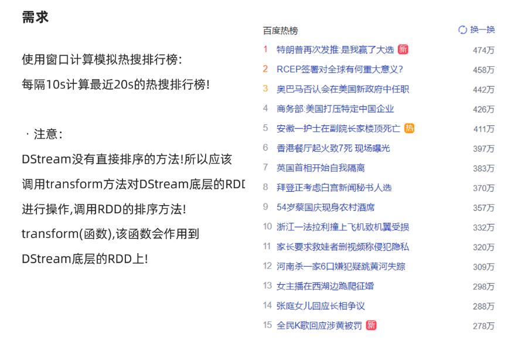

```java
package cn.xiaoguangbiao.streaming

import org.apache.spark.rdd.RDD
import org.apache.spark.streaming.dstream.{DStream, ReceiverInputDStream}
import org.apache.spark.streaming.{Seconds, StreamingContext}
import org.apache.spark.{SparkConf, SparkContext}

/**
 * Author xiaoguangbiao
 * Desc 使用SparkStreaming接收node1:9999的数据并做WordCount+窗口计算
 * 模拟百度热搜排行榜每隔10s计算最近20s的热搜词
 */
object WordCount05 {
  def main(args: Array[String]): Unit = {
    //TODO 0.准备环境
    val conf: SparkConf = new SparkConf().setAppName("spark").setMaster("local[*]")
    val sc: SparkContext = new SparkContext(conf)
    sc.setLogLevel("WARN")
    //the time interval at which streaming data will be divided into batches
    val ssc: StreamingContext = new StreamingContext(sc,Seconds(5))//每隔5s划分一个批次

    //TODO 1.加载数据
    val lines: ReceiverInputDStream[String] = ssc.socketTextStream("node1",9999)

    //TODO 2.处理数据
    val resultDS: DStream[(String, Int)] = lines.flatMap(_.split(" "))
      .map((_, 1))
      //模拟百度热搜排行榜每隔10s计算最近20s的热搜词Top3
      //windowDuration: Duration,
      //slideDuration: Duration
      .reduceByKeyAndWindow((a: Int, b: Int) => a + b, Seconds(20), Seconds(10))
      //注意DStream没有提供直接排序的方法,所以需要直接对底层的RDD操作
    //DStream的transform方法表示对DStream底层的RDD进行操作并返回结果
    val sortedResultDS: DStream[(String, Int)] = resultDS.transform(rdd => {
      val sortRDD: RDD[(String, Int)] = rdd.sortBy(_._2, false)
      val top3: Array[(String, Int)] = sortRDD.take(3)
      println("=======top3=====")
      top3.foreach(println)
      println("=======top3=====")
      sortRDD
    })

    //TODO 3.输出结果
    sortedResultDS.print()

    //TODO 4.启动并等待结束
    ssc.start()
    ssc.awaitTermination()//注意:流式应用程序启动之后需要一直运行等待手动停止/等待数据到来

    //TODO 5.关闭资源
    ssc.stop(stopSparkContext = true, stopGracefully = true)//优雅关闭
  }
}
/*
31省新增本土确诊23例:河北20例 31省新增本土确诊23例:河北20例 31省新增本土确诊23例:河北20例 31省新增本土确诊23例:河北20例
特朗普签令禁止与8款中国应用交易 特朗普签令禁止与8款中国应用交易
纸张价格上涨直逼猪肉 纸张价格上涨直逼猪肉 纸张价格上涨直逼猪肉 纸张价格上涨直逼猪肉 纸张价格上涨直逼猪肉 纸张价格上涨直逼猪肉
多家航空公司发布进出京退改票方案 多家航空公司发布进出京退改票方案 多家航空公司发布进出京退改票方案
石家庄中小学幼儿园暂停线下教学
 */

```


## 案例6-自定义输出

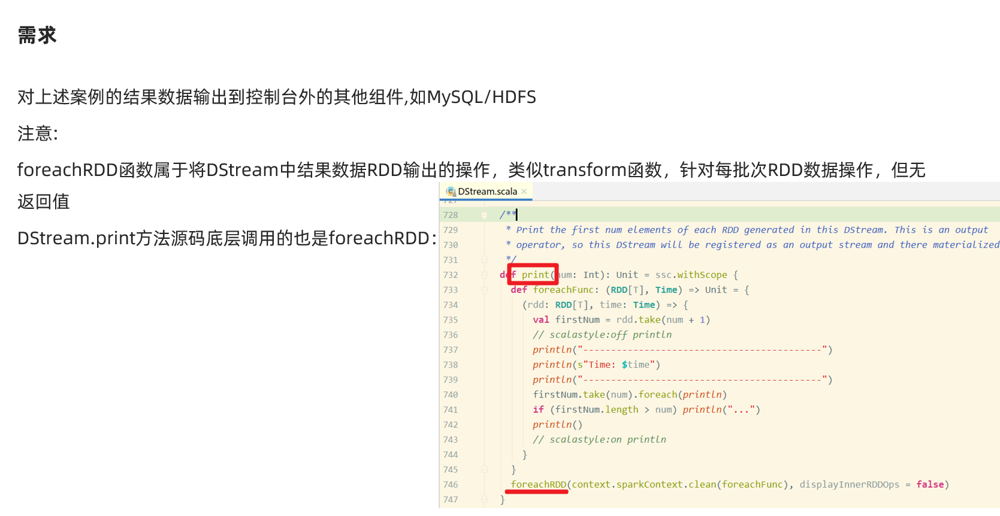

```java
package cn.xiaoguangbiao.streaming

import java.sql.{Connection, DriverManager, PreparedStatement, Timestamp}

import org.apache.spark.rdd.RDD
import org.apache.spark.streaming.dstream.{DStream, ReceiverInputDStream}
import org.apache.spark.streaming.{Seconds, StreamingContext}
import org.apache.spark.{SparkConf, SparkContext}

/**
 * Author xiaoguangbiao
 * Desc 使用SparkStreaming接收node1:9999的数据并做WordCount+窗口计算
 * 模拟百度热搜排行榜每隔10s计算最近20s的热搜词
 * 最后使用自定义输出将结果输出到控制台/HDFS/MySQL
 */
object WordCount06 {
  def main(args: Array[String]): Unit = {
    //TODO 0.准备环境
    val conf: SparkConf = new SparkConf().setAppName("spark").setMaster("local[*]")
    val sc: SparkContext = new SparkContext(conf)
    sc.setLogLevel("WARN")
    //the time interval at which streaming data will be divided into batches
    val ssc: StreamingContext = new StreamingContext(sc,Seconds(5))//每隔5s划分一个批次

    //TODO 1.加载数据
    val lines: ReceiverInputDStream[String] = ssc.socketTextStream("node1",9999)

    //TODO 2.处理数据
    val resultDS: DStream[(String, Int)] = lines.flatMap(_.split(" "))
      .map((_, 1))
      //模拟百度热搜排行榜每隔10s计算最近20s的热搜词Top3
      //windowDuration: Duration,
      //slideDuration: Duration
      .reduceByKeyAndWindow((a: Int, b: Int) => a + b, Seconds(20), Seconds(10))
      //注意DStream没有提供直接排序的方法,所以需要直接对底层的RDD操作
    //DStream的transform方法表示对DStream底层的RDD进行操作并返回结果
    val sortedResultDS: DStream[(String, Int)] = resultDS.transform(rdd => {
      val sortRDD: RDD[(String, Int)] = rdd.sortBy(_._2, false)
      val top3: Array[(String, Int)] = sortRDD.take(3)
      println("=======top3=====")
      top3.foreach(println)
      println("=======top3=====")
      sortRDD
    })

    //TODO 3.输出结果
    sortedResultDS.print()//默认的输出
    //自定义输出
    sortedResultDS.foreachRDD((rdd,time)=>{
      val milliseconds: Long = time.milliseconds
      println("------自定义输出---------")
      println("batchtime:"+milliseconds)
      println("------自定义输出---------")
      //最后使用自定义输出将结果输出到控制台/HDFS/MySQL
      //输出到控制台
      rdd.foreach(println)
      //输出到HDFS
      rdd.coalesce(1).saveAsTextFile("data/output/result-"+milliseconds)
      //输出到MySQL
      /*
CREATE TABLE `t_hotwords` (
  `time` timestamp NOT NULL DEFAULT CURRENT_TIMESTAMP ON UPDATE CURRENT_TIMESTAMP,
  `word` varchar(255) NOT NULL,
  `count` int(11) DEFAULT NULL,
  PRIMARY KEY (`time`,`word`)
) ENGINE=InnoDB DEFAULT CHARSET=utf8;
       */
      rdd.foreachPartition(iter=>{
        //开启连接
        val conn: Connection = DriverManager.getConnection("jdbc:mysql://localhost:3306/bigdata?characterEncoding=UTF-8","root","root")
        val sql:String = "INSERT INTO `t_hotwords` (`time`, `word`, `count`) VALUES (?, ?, ?);"
        val ps: PreparedStatement = conn.prepareStatement(sql)
        iter.foreach(t=>{
          val word: String = t._1
          val count: Int = t._2
          ps.setTimestamp(1,new Timestamp(milliseconds) )
          ps.setString(2,word)
          ps.setInt(3,count)
          ps.addBatch()
        })
        ps.executeBatch()
        //关闭连接
        if (conn != null) conn.close()
        if (ps != null) ps.close()
      })
    })

    //TODO 4.启动并等待结束
    ssc.start()
    ssc.awaitTermination()//注意:流式应用程序启动之后需要一直运行等待手动停止/等待数据到来

    //TODO 5.关闭资源
    ssc.stop(stopSparkContext = true, stopGracefully = true)//优雅关闭
  }
}
/*
31省新增本土确诊23例:河北20例 31省新增本土确诊23例:河北20例 31省新增本土确诊23例:河北20例 31省新增本土确诊23例:河北20例
特朗普签令禁止与8款中国应用交易 特朗普签令禁止与8款中国应用交易
纸张价格上涨直逼猪肉 纸张价格上涨直逼猪肉 纸张价格上涨直逼猪肉 纸张价格上涨直逼猪肉 纸张价格上涨直逼猪肉 纸张价格上涨直逼猪肉
多家航空公司发布进出京退改票方案 多家航空公司发布进出京退改票方案 多家航空公司发布进出京退改票方案
石家庄中小学幼儿园暂停线下教学
 */
```


# SparkStreaming整合Kafka

## 前置说明

### SparkStreaming+Kafka流程

流式数据 ---> (Flume)---->Kafka--->SparkStreaming/StructStreaming/Flink--->Redis/HBase/HDFS


### Kafka简单回顾

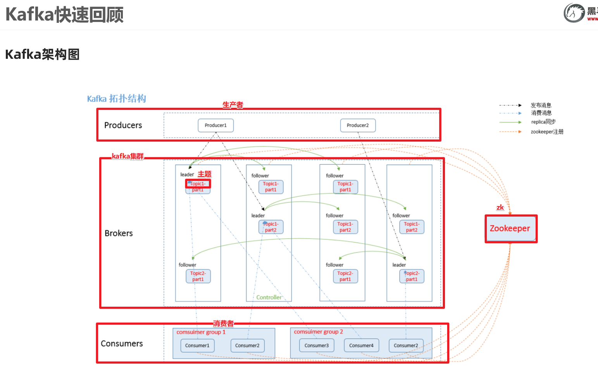


```
#启动kafka
/export/server/kafka/bin/kafka-server-start.sh -daemon /export/server/kafka/config/server.properties 

#停止kafka
/export/server/kafka/bin/kafka-server-stop.sh 

#查看topic信息
/export/server/kafka/bin/kafka-topics.sh --list --zookeeper node1:2181
 
#创建topic
/export/server/kafka/bin/kafka-topics.sh --create --zookeeper node1:2181 --replication-factor 1 --partitions 3 --topic test
 
#查看某个topic信息
/export/server/kafka/bin/kafka-topics.sh --describe --zookeeper node1:2181 --topic test
 
#删除topic
/export/server/kafka/bin/kafka-topics.sh --zookeeper node1:2181 --delete --topic test
 
#启动生产者--控制台的生产者--一般用于测试
/export/server/kafka/bin/kafka-console-producer.sh --broker-list node1:9092 --topic spark_kafka

 
# 启动消费者--控制台的消费者
/export/server/kafka/bin/kafka-console-consumer.sh --bootstrap-server node1:9092 --topic spark_kafka --from-beginning 
```


### SparkStreaming连接Kafka两种方式


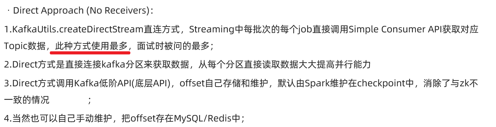


### 两种API

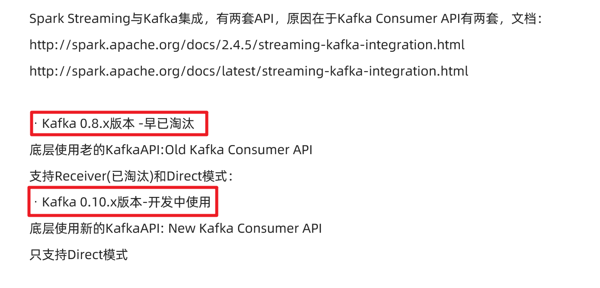

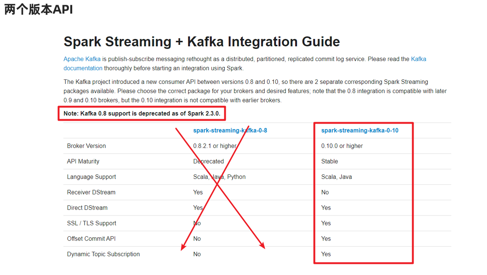

### 总结

在学习和开发中都是直接使用spark-Streaming-kafka-0.10版本API中的Direct模式来连接Kafka! 


## 代码演示-1-自动提交偏移量-掌握

http://spark.apache.org/docs/latest/streaming-kafka-0-10-integration.html

自动提交偏移量到默认主题和Checkpoint中

```java
package cn.xiaoguangbiao.streaming

import org.apache.kafka.clients.consumer.ConsumerRecord
import org.apache.kafka.common.serialization.StringDeserializer
import org.apache.spark.streaming.dstream.{DStream, InputDStream}
import org.apache.spark.streaming.kafka010.{ConsumerStrategies, KafkaUtils, LocationStrategies}
import org.apache.spark.{SparkConf, SparkContext}
import org.apache.spark.streaming.{Seconds, StreamingContext}

/**
 * Author xiaoguangbiao
 * Desc 演示使用spark-streaming-kafka-0-10_2.12中的Direct模式连接Kafka消费数据
 */
object SparkStreaming_Kafka_Demo01 {
  def main(args: Array[String]): Unit = {
    //TODO 0.准备环境
    val conf: SparkConf = new SparkConf().setAppName("spark").setMaster("local[*]")
    val sc: SparkContext = new SparkContext(conf)
    sc.setLogLevel("WARN")
    //the time interval at which streaming data will be divided into batches
    val ssc: StreamingContext = new StreamingContext(sc,Seconds(5))//每隔5s划分一个批次
    ssc.checkpoint("./ckp")

    //TODO 1.加载数据-从Kafka
    val kafkaParams = Map[String, Object](
      "bootstrap.servers" -> "node1:9092",//kafka集群地址
      "key.deserializer" -> classOf[StringDeserializer],//key的反序列化规则
      "value.deserializer" -> classOf[StringDeserializer],//value的反序列化规则
      "group.id" -> "sparkdemo",//消费者组名称
      //earliest:表示如果有offset记录从offset记录开始消费,如果没有从最早的消息开始消费
      //latest:表示如果有offset记录从offset记录开始消费,如果没有从最后/最新的消息开始消费
      //none:表示如果有offset记录从offset记录开始消费,如果没有就报错
      "auto.offset.reset" -> "latest",
      "auto.commit.interval.ms"->"1000",//自动提交的时间间隔
      "enable.auto.commit" -> (true: java.lang.Boolean)//是否自动提交
    )
    val topics = Array("spark_kafka")//要订阅的主题
    //使用工具类从Kafka中消费消息
    val kafkaDS: InputDStream[ConsumerRecord[String, String]] = KafkaUtils.createDirectStream[String, String](
      ssc,
      LocationStrategies.PreferConsistent, //位置策略,使用源码中推荐的
      ConsumerStrategies.Subscribe[String, String](topics, kafkaParams) //消费策略,使用源码中推荐的
    )

    //TODO 2.处理消息
    val infoDS: DStream[String] = kafkaDS.map(record => {
      val topic: String = record.topic()
      val partition: Int = record.partition()
      val offset: Long = record.offset()
      val key: String = record.key()
      val value: String = record.value()
      val info: String = s"""topic:${topic}, partition:${partition}, offset:${offset}, key:${key}, value:${value}"""
      info
    })

    //TODO 3.输出结果
    infoDS.print()

    //TODO 4.启动并等待结束
    ssc.start()
    ssc.awaitTermination()//注意:流式应用程序启动之后需要一直运行等待手动停止/等待数据到来

    //TODO 5.关闭资源
    ssc.stop(stopSparkContext = true, stopGracefully = true)//优雅关闭
  }
}
//测试:
//1.准备kafka
// /export/server/kafka/bin/kafka-topics.sh --list --zookeeper node1:2181
// /export/server/kafka/bin/kafka-topics.sh --create --zookeeper node1:2181 --replication-factor 1 --partitions 3 --topic spark_kafka
// /export/server/kafka/bin/kafka-console-producer.sh --broker-list node1:9092 --topic spark_kafka
//2.启动程序
//3.发送数据
//4.观察结果
```


## 代码演示-2-手动提交

```java
package cn.xiaoguangbiao.streaming

import org.apache.kafka.clients.consumer.ConsumerRecord
import org.apache.kafka.common.serialization.StringDeserializer
import org.apache.spark.streaming.dstream.{DStream, InputDStream}
import org.apache.spark.streaming.kafka010.{CanCommitOffsets, ConsumerStrategies, HasOffsetRanges, KafkaUtils, LocationStrategies, OffsetRange}
import org.apache.spark.streaming.{Seconds, StreamingContext}
import org.apache.spark.{SparkConf, SparkContext}

/**
 * Author xiaoguangbiao
 * Desc 演示使用spark-streaming-kafka-0-10_2.12中的Direct模式连接Kafka消费数据+手动提交offset
 */
object SparkStreaming_Kafka_Demo02 {
  def main(args: Array[String]): Unit = {
    //TODO 0.准备环境
    val conf: SparkConf = new SparkConf().setAppName("spark").setMaster("local[*]")
    val sc: SparkContext = new SparkContext(conf)
    sc.setLogLevel("WARN")
    //the time interval at which streaming data will be divided into batches
    val ssc: StreamingContext = new StreamingContext(sc, Seconds(5)) //每隔5s划分一个批次
    ssc.checkpoint("./ckp")

    //TODO 1.加载数据-从Kafka
    val kafkaParams = Map[String, Object](
      "bootstrap.servers" -> "node1:9092", //kafka集群地址
      "key.deserializer" -> classOf[StringDeserializer], //key的反序列化规则
      "value.deserializer" -> classOf[StringDeserializer], //value的反序列化规则
      "group.id" -> "sparkdemo", //消费者组名称
      //earliest:表示如果有offset记录从offset记录开始消费,如果没有从最早的消息开始消费
      //latest:表示如果有offset记录从offset记录开始消费,如果没有从最后/最新的消息开始消费
      //none:表示如果有offset记录从offset记录开始消费,如果没有就报错
      "auto.offset.reset" -> "latest",
      //"auto.commit.interval.ms"->"1000",//自动提交的时间间隔
      "enable.auto.commit" -> (false: java.lang.Boolean) //是否自动提交
    )
    val topics = Array("spark_kafka") //要订阅的主题
    //使用工具类从Kafka中消费消息
    val kafkaDS: InputDStream[ConsumerRecord[String, String]] = KafkaUtils.createDirectStream[String, String](
      ssc,
      LocationStrategies.PreferConsistent, //位置策略,使用源码中推荐的
      ConsumerStrategies.Subscribe[String, String](topics, kafkaParams) //消费策略,使用源码中推荐的
    )

    //TODO 2.处理消息
    //注意提交的时机:应该是消费完一小批就该提交一次offset,而在DStream一小批的体现是RDD
    kafkaDS.foreachRDD(rdd => {
      if(!rdd.isEmpty()){
        //消费
        rdd.foreach(record => {
          val topic: String = record.topic()
          val partition: Int = record.partition()
          val offset: Long = record.offset()
          val key: String = record.key()
          val value: String = record.value()
          val info: String = s"""topic:${topic}, partition:${partition}, offset:${offset}, key:${key}, value:${value}"""
          println("消费到的消息的详细信息为: "+info)
        })
        //获取rdd中offset相关的信息:offsetRanges里面就包含了该批次各个分区的offset信息
        val offsetRanges: Array[OffsetRange] = rdd.asInstanceOf[HasOffsetRanges].offsetRanges
        //提交
        kafkaDS.asInstanceOf[CanCommitOffsets].commitAsync(offsetRanges)
        println("当前批次的数据已消费并手动提交")
      }
    })

    //TODO 3.输出结果

    //TODO 4.启动并等待结束
    ssc.start()
    ssc.awaitTermination() //注意:流式应用程序启动之后需要一直运行等待手动停止/等待数据到来

    //TODO 5.关闭资源
    ssc.stop(stopSparkContext = true, stopGracefully = true) //优雅关闭
  }
}

//测试:
//1.准备kafka
// /export/server/kafka/bin/kafka-topics.sh --list --zookeeper node1:2181
// /export/server/kafka/bin/kafka-topics.sh --create --zookeeper node1:2181 --replication-factor 1 --partitions 3 --topic spark_kafka
// /export/server/kafka/bin/kafka-console-producer.sh --broker-list node1:9092 --topic spark_kafka
//2.启动程序
//3.发送数据
//4.观察结果
```


## 代码演示-3-手动提交到MySQL-扩展

```java
package cn.xiaoguangbiao.streaming

import java.sql.{DriverManager, ResultSet}

import org.apache.kafka.clients.consumer.ConsumerRecord
import org.apache.kafka.common.TopicPartition
import org.apache.kafka.common.serialization.StringDeserializer
import org.apache.spark.streaming.dstream.InputDStream
import org.apache.spark.streaming.kafka010._
import org.apache.spark.streaming.{Seconds, StreamingContext}
import org.apache.spark.{SparkConf, SparkContext}

import scala.collection.mutable

/**
 * Author xiaoguangbiao
 * Desc 演示使用spark-streaming-kafka-0-10_2.12中的Direct模式连接Kafka消费数据+手动提交offset到MySQL
 */
object SparkStreaming_Kafka_Demo03 {
  def main(args: Array[String]): Unit = {
    //TODO 0.准备环境
    val conf: SparkConf = new SparkConf().setAppName("spark").setMaster("local[*]")
    val sc: SparkContext = new SparkContext(conf)
    sc.setLogLevel("WARN")
    //the time interval at which streaming data will be divided into batches
    val ssc: StreamingContext = new StreamingContext(sc, Seconds(5)) //每隔5s划分一个批次
    ssc.checkpoint("./ckp")

    //TODO 1.加载数据-从Kafka
    val kafkaParams = Map[String, Object](
      "bootstrap.servers" -> "node1:9092", //kafka集群地址
      "key.deserializer" -> classOf[StringDeserializer], //key的反序列化规则
      "value.deserializer" -> classOf[StringDeserializer], //value的反序列化规则
      "group.id" -> "sparkdemo", //消费者组名称
      //earliest:表示如果有offset记录从offset记录开始消费,如果没有从最早的消息开始消费
      //latest:表示如果有offset记录从offset记录开始消费,如果没有从最后/最新的消息开始消费
      //none:表示如果有offset记录从offset记录开始消费,如果没有就报错
      "auto.offset.reset" -> "latest",
      //"auto.commit.interval.ms"->"1000",//自动提交的时间间隔
      "enable.auto.commit" -> (false: java.lang.Boolean) //是否自动提交
    )
    val topics = Array("spark_kafka") //要订阅的主题

    //Map[主题分区, offset]
    val offsetsMap: mutable.Map[TopicPartition, Long] = OffsetUtil.getOffsetMap("sparkdemo","spark_kafka")
    val kafkaDS: InputDStream[ConsumerRecord[String, String]] =  if(offsetsMap.size > 0){
      println("MySQL中存储了该消费者组消费该主题的偏移量记录,接下来从记录处开始消费")
      //使用工具类从Kafka中消费消息
      KafkaUtils.createDirectStream[String, String](
        ssc,
        LocationStrategies.PreferConsistent, //位置策略,使用源码中推荐的
        ConsumerStrategies.Subscribe[String, String](topics, kafkaParams,offsetsMap) //消费策略,使用源码中推荐的
      )
    }else{
      println("MySQL中没有存储该消费者组消费该主题的偏移量记录,接下来从latest开始消费")
      //使用工具类从Kafka中消费消息
      KafkaUtils.createDirectStream[String, String](
        ssc,
        LocationStrategies.PreferConsistent, //位置策略,使用源码中推荐的
        ConsumerStrategies.Subscribe[String, String](topics, kafkaParams) //消费策略,使用源码中推荐的
      )
    }


    //TODO 2.处理消息
    //注意提交的时机:应该是消费完一小批就该提交一次offset,而在DStream一小批的体现是RDD
    kafkaDS.foreachRDD(rdd => {
      if(!rdd.isEmpty()){
        //消费
        rdd.foreach(record => {
          val topic: String = record.topic()
          val partition: Int = record.partition()
          val offset: Long = record.offset()
          val key: String = record.key()
          val value: String = record.value()
          val info: String = s"""topic:${topic}, partition:${partition}, offset:${offset}, key:${key}, value:${value}"""
          println("消费到的消息的详细信息为: "+info)
        })
        //获取rdd中offset相关的信息:offsetRanges里面就包含了该批次各个分区的offset信息
        val offsetRanges: Array[OffsetRange] = rdd.asInstanceOf[HasOffsetRanges].offsetRanges
        //提交
        //kafkaDS.asInstanceOf[CanCommitOffsets].commitAsync(offsetRanges)
        //提交到MySQL
        OffsetUtil.saveOffsetRanges("sparkdemo",offsetRanges)
        println("当前批次的数据已消费并手动提交到MySQL")
      }
    })

    //TODO 3.输出结果

    //TODO 4.启动并等待结束
    ssc.start()
    ssc.awaitTermination() //注意:流式应用程序启动之后需要一直运行等待手动停止/等待数据到来

    //TODO 5.关闭资源
    ssc.stop(stopSparkContext = true, stopGracefully = true) //优雅关闭
  }
  /*
 手动维护offset的工具类
 首先在MySQL创建如下表
   CREATE TABLE `t_offset` (
     `topic` varchar(255) NOT NULL,
     `partition` int(11) NOT NULL,
     `groupid` varchar(255) NOT NULL,
     `offset` bigint(20) DEFAULT NULL,
     PRIMARY KEY (`topic`,`partition`,`groupid`)
   ) ENGINE=InnoDB DEFAULT CHARSET=utf8;
  */
  object OffsetUtil {
    //1.将偏移量保存到数据库
    def saveOffsetRanges(groupid: String, offsetRange: Array[OffsetRange]) = {
      val connection = DriverManager.getConnection("jdbc:mysql://localhost:3306/bigdata?characterEncoding=UTF-8", "root", "root")
      //replace into表示之前有就替换,没有就插入
      val ps = connection.prepareStatement("replace into t_offset (`topic`, `partition`, `groupid`, `offset`) values(?,?,?,?)")
      for (o <- offsetRange) {
        ps.setString(1, o.topic)
        ps.setInt(2, o.partition)
        ps.setString(3, groupid)
        ps.setLong(4, o.untilOffset)
        ps.executeUpdate()
      }
      ps.close()
      connection.close()
    }

    //2.从数据库读取偏移量Map(主题分区,offset)
    def getOffsetMap(groupid: String, topic: String) = {
      val connection = DriverManager.getConnection("jdbc:mysql://localhost:3306/bigdata?characterEncoding=UTF-8", "root", "root")
      val ps = connection.prepareStatement("select * from t_offset where groupid=? and topic=?")
      ps.setString(1, groupid)
      ps.setString(2, topic)
      val rs: ResultSet = ps.executeQuery()
      //Map(主题分区,offset)
      val offsetMap: mutable.Map[TopicPartition, Long] = mutable.Map[TopicPartition, Long]()
      while (rs.next()) {
        offsetMap += new TopicPartition(rs.getString("topic"), rs.getInt("partition")) -> rs.getLong("offset")
      }
      rs.close()
      ps.close()
      connection.close()
      offsetMap
    }
  }

}

//测试:
//1.准备kafka
// /export/server/kafka/bin/kafka-topics.sh --list --zookeeper node1:2181
// /export/server/kafka/bin/kafka-topics.sh --create --zookeeper node1:2181 --replication-factor 1 --partitions 3 --topic spark_kafka
// /export/server/kafka/bin/kafka-console-producer.sh --broker-list node1:9092 --topic spark_kafka
//2.启动程序
//3.发送数据
//4.观察结果
```


# SparkSQL概述

## 数据分析方式

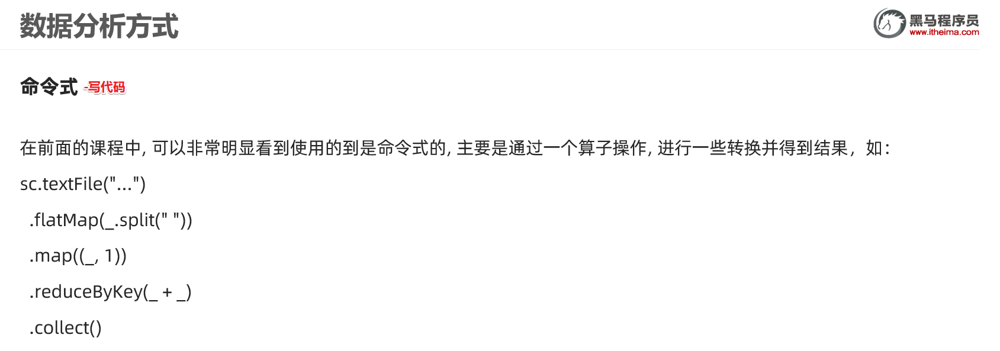

缺点: 有一定的学习成本/入门门槛

优点: 灵活!可以使用底层的API完成很复杂的业务


优点:入门门槛低,只要会英文单词/简单语法规则就可以写

缺点:只能做一些简单的业务,复杂业务实现起来较困难


## SparkSQL发展历史

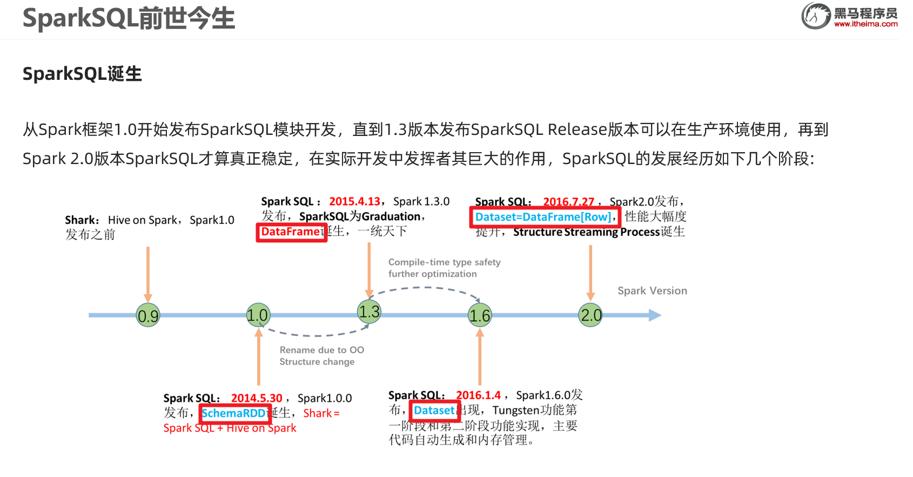

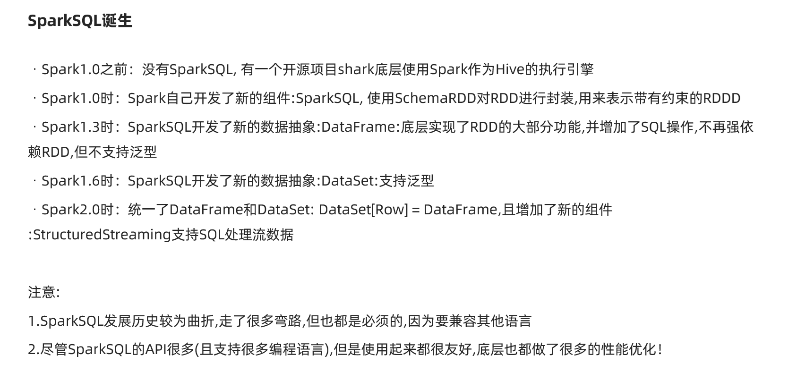


## SparkSQL官方介绍

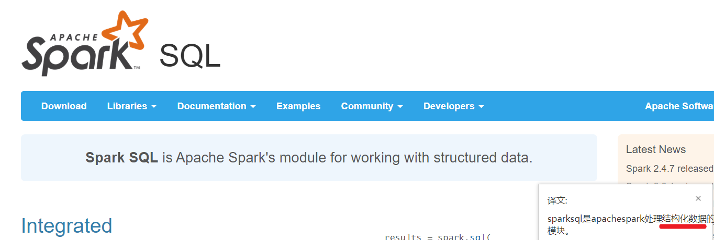


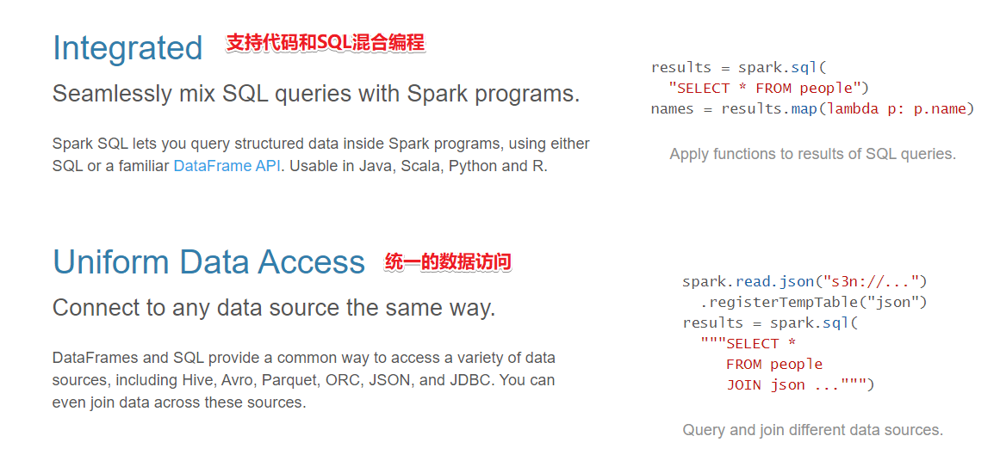

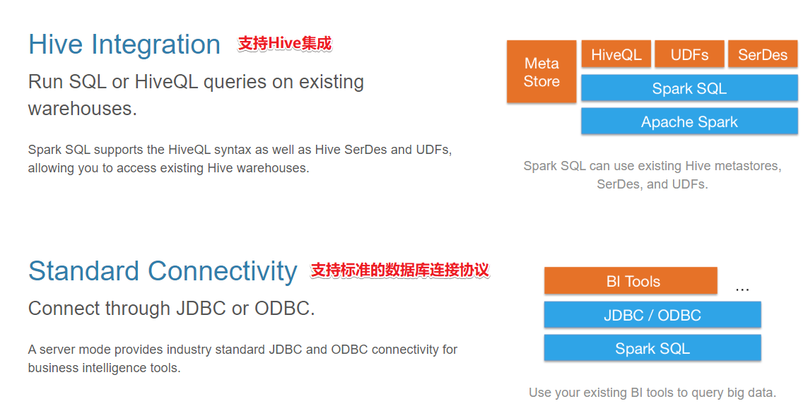

说明:

- 结构化数据--支持

   有固定的结构和约束Schema(字段名称/类型)

  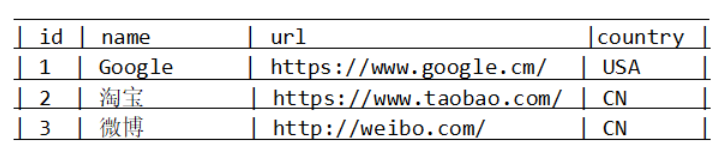

- 半结构化数据--支持较为严格的半结构化数据

  有不是固定的结构和约束

  ```json
  [
  {
      "name": "jack",
      "tel": "1388888888",
  },
  {
      "name": "jack",
      "tel": 13888888888,
      "age":18
  },
  {
      "name": "jack",
      "tel": "1388888888",
      "age": "18"
  }
  ]
  ```

- 非结构数据--需要处理之后变为结构化/半结构化才支持

​      如视频/图片/音频...


# SparkSQL数据抽象

SparkCore的数据抽象:RDD

SparkStreaming的数据抽象:DStream,底层是RDD

SparkSQL的数据抽象:DataFrame和DataSet,底层是RDD

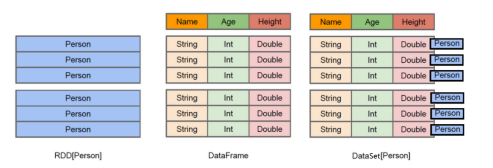

## DataFrame

DataFrame = RDD - 泛型  + Schema约束(指定了字段名和类型) + SQL操作 + 优化

DataFrame 就是在RDD的基础之上做了进一步的封装,支持SQL操作!

DataFrame 就是一个分布式表!


## DataSet

DataSet = DataFrame + 泛型

DataSet = RDD  + Schema约束(指定了字段名和类型) + SQL操作 + 优化

DataSet 就是在RDD的基础之上做了进一步的封装,支持SQL操作!

DataSet 就是一个分布式表!


# SparkSQL实战 --> SparkSql.md

