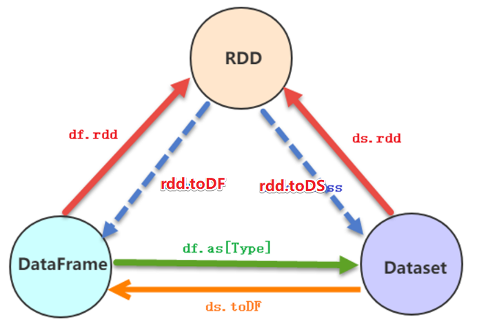
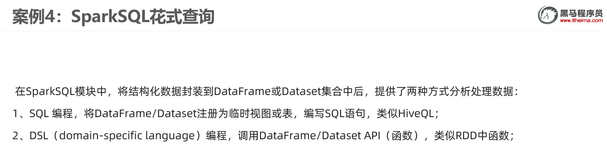
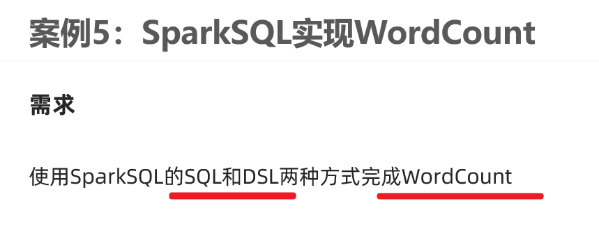
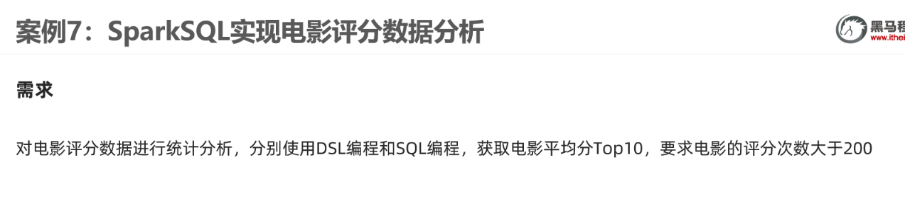
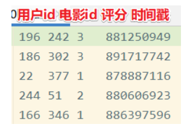
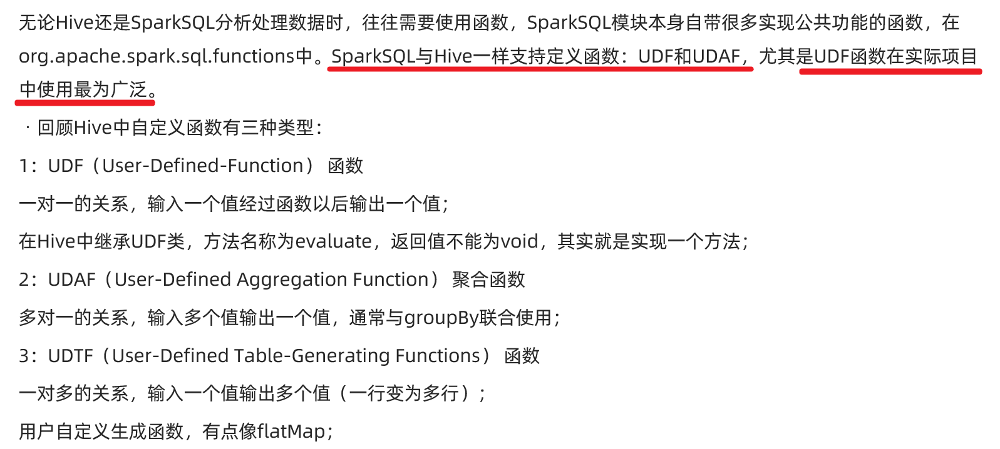
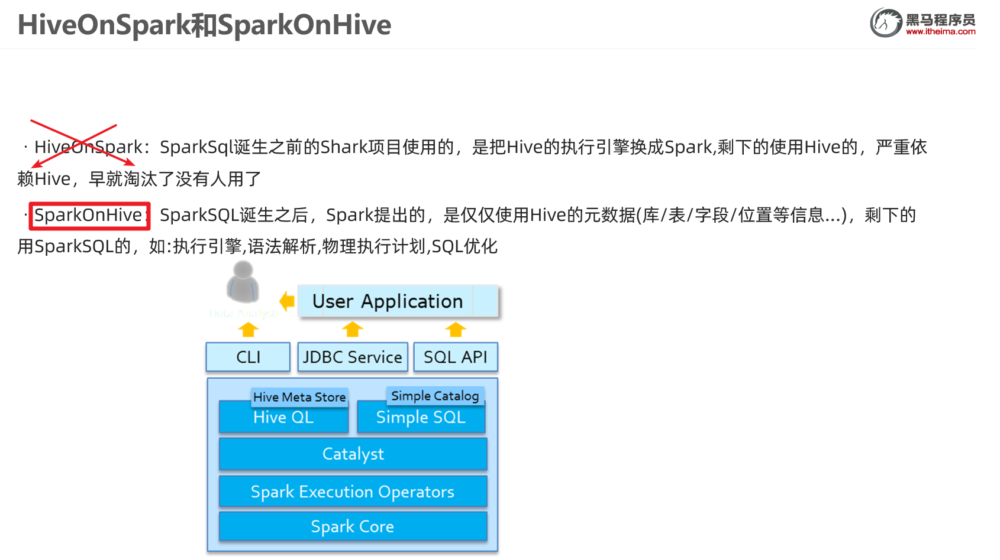

# SparkSQL实战

## 实战1-加载数据成为分布式表

```java
package cn.xiaoguangbiao.sql

import org.apache.spark.SparkContext
import org.apache.spark.sql.{DataFrame, Dataset, SparkSession}

/**
 * Author xiaoguangbiao
 * Desc 演示SparkSQL初体验
 */
object Demo01 {
  def main(args: Array[String]): Unit = {
    //TODO 0.准备环境
    val spark: SparkSession = SparkSession.builder().appName("sparksql").master("local[*]").getOrCreate()
    val sc: SparkContext = spark.sparkContext
    sc.setLogLevel("WARN")

    //TODO 1.加载数据
    val df1: DataFrame = spark.read.text("data/input/text")
    val df2: DataFrame = spark.read.json("data/input/json")
    val df3: DataFrame = spark.read.csv("data/input/csv")

    //TODO 2.处理数据

    //TODO 3.输出结果
    df1.printSchema()
    df2.printSchema()
    df3.printSchema()
    df1.show()
    df2.show()
    df3.show()

    //TODO 4.关闭资源
    spark.stop()
  }
}

```


## 案例2-将RDD转为DataFrame

### 使用样例类

```java
package cn.xiaoguangbiao.sql

import org.apache.spark
import org.apache.spark.SparkContext
import org.apache.spark.rdd.RDD
import org.apache.spark.sql.{DataFrame, SparkSession}

/**
 * Author xiaoguangbiao
 * Desc 演示SparkSQL-RDD2DataFrame
 */
object Demo02_RDD2DataFrame1 {
  def main(args: Array[String]): Unit = {
    //TODO 0.准备环境
    val spark: SparkSession = SparkSession.builder().appName("sparksql").master("local[*]").getOrCreate()
    val sc: SparkContext = spark.sparkContext
    sc.setLogLevel("WARN")

    //TODO 1.加载数据
    val lines: RDD[String] = sc.textFile("data/input/person.txt")

    //TODO 2.处理数据
    val personRDD: RDD[Person] = lines.map(line => {
      val arr: Array[String] = line.split(" ")
      Person(arr(0).toInt, arr(1), arr(2).toInt)
    })

    //RDD-->DF
    import spark.implicits._
    val personDF: DataFrame = personRDD.toDF()

    //TODO 3.输出结果
    personDF.printSchema()
    personDF.show()

    //TODO 4.关闭资源
    spark.stop()
  }
  case class Person(id:Int,name:String,age:Int)
}

```


### 指定类型+列名

```java
package cn.xiaoguangbiao.sql

import cn.xiaoguangbiao.sql.Demo02_RDD2DataFrame1.Person
import org.apache.spark.SparkContext
import org.apache.spark.rdd.RDD
import org.apache.spark.sql.{DataFrame, SparkSession}

/**
 * Author xiaoguangbiao
 * Desc 演示SparkSQL-RDD2DataFrame-指定类型和列名
 */
object Demo02_RDD2DataFrame2 {
  def main(args: Array[String]): Unit = {
    //TODO 0.准备环境
    val spark: SparkSession = SparkSession.builder().appName("sparksql").master("local[*]").getOrCreate()
    val sc: SparkContext = spark.sparkContext
    sc.setLogLevel("WARN")

    //TODO 1.加载数据
    val lines: RDD[String] = sc.textFile("data/input/person.txt")

    //TODO 2.处理数据
    val tupleRDD: RDD[(Int, String, Int)] = lines.map(line => {
      val arr: Array[String] = line.split(" ")
      (arr(0).toInt, arr(1), arr(2).toInt)
    })

    //RDD-->DF
    import spark.implicits._
    val personDF: DataFrame = tupleRDD.toDF("id","name","age")

    //TODO 3.输出结果
    personDF.printSchema()
    personDF.show()

    //TODO 4.关闭资源
    spark.stop()
  }

}

```


### 自定义Schema

```java
package cn.xiaoguangbiao.sql

import org.apache.spark.SparkContext
import org.apache.spark.rdd.RDD
import org.apache.spark.sql.types.{IntegerType, StringType, StructField, StructType}
import org.apache.spark.sql.{DataFrame, Row, SparkSession}

/**
 * Author xiaoguangbiao
 * Desc 演示SparkSQL-RDD2DataFrame-自定义Schema
 */
object Demo02_RDD2DataFrame3 {
  def main(args: Array[String]): Unit = {
    //TODO 0.准备环境
    val spark: SparkSession = SparkSession.builder().appName("sparksql").master("local[*]").getOrCreate()
    val sc: SparkContext = spark.sparkContext
    sc.setLogLevel("WARN")

    //TODO 1.加载数据
    val lines: RDD[String] = sc.textFile("data/input/person.txt")

    //TODO 2.处理数据
    val rowRDD: RDD[Row] = lines.map(line => {
      val arr: Array[String] = line.split(" ")
      Row(arr(0).toInt, arr(1), arr(2).toInt)
    })

    //RDD-->DF
    import spark.implicits._
    /*val schema: StructType = StructType(
          StructField("id", IntegerType, false) ::
          StructField("name", StringType, false) ::
          StructField("age", IntegerType, false) :: Nil)*/
    val schema: StructType = StructType(List(
      StructField("id", IntegerType, false),
      StructField("name", StringType, false),
      StructField("age", IntegerType, false)
    ))

    val personDF: DataFrame = spark.createDataFrame(rowRDD, schema)

    //TODO 3.输出结果
    personDF.printSchema()
    personDF.show()

    //TODO 4.关闭资源
    spark.stop()
  }

}

```


## 案例3-RDD-DF-DS相互转换



```java
package cn.xiaoguangbiao.sql

import org.apache.spark.SparkContext
import org.apache.spark.rdd.RDD
import org.apache.spark.sql.{DataFrame, Dataset, Row, SparkSession}

/**
 * Author xiaoguangbiao
 * Desc 演示SparkSQL-RDD_DF_DS相互转换
 */
object Demo03_RDD_DF_DS {
  def main(args: Array[String]): Unit = {
    //TODO 0.准备环境
    val spark: SparkSession = SparkSession.builder().appName("sparksql").master("local[*]").getOrCreate()
    val sc: SparkContext = spark.sparkContext
    sc.setLogLevel("WARN")

    //TODO 1.加载数据
    val lines: RDD[String] = sc.textFile("data/input/person.txt")

    //TODO 2.处理数据
    val personRDD: RDD[Person] = lines.map(line => {
      val arr: Array[String] = line.split(" ")
      Person(arr(0).toInt, arr(1), arr(2).toInt)
    })

    //转换1:RDD-->DF
    import spark.implicits._
    val personDF: DataFrame = personRDD.toDF()
    //转换2:RDD-->DS
    val personDS: Dataset[Person] = personRDD.toDS()
    //转换3:DF-->RDD,注意:DF没有泛型,转为RDD时使用的是Row
    val rdd: RDD[Row] = personDF.rdd
    //转换4:DS-->RDD
    val rdd1: RDD[Person] = personDS.rdd
    //转换5:DF-->DS
    val ds: Dataset[Person] = personDF.as[Person]
    //转换6:DS-->DF
    val df: DataFrame = personDS.toDF()


    //TODO 3.输出结果
    personDF.printSchema()
    personDF.show()
    personDS.printSchema()
    personDS.show()
    rdd.foreach(println)
    rdd1.foreach(println)

    //TODO 4.关闭资源
    spark.stop()
  }
  case class Person(id:Int,name:String,age:Int)
}

```


## 案例4-SparkSQL花式查询



需求:针对personDF中的数据使用SQL和DSL两种方式进行各种查询

```java
package cn.xiaoguangbiao.sql

import org.apache.spark.SparkContext
import org.apache.spark.rdd.RDD
import org.apache.spark.sql.{DataFrame, SparkSession}

/**
 * Author xiaoguangbiao
 * Desc 演示SparkSQL-SQL和DSL两种方式实现各种查询
 */
object Demo04_Query {
  def main(args: Array[String]): Unit = {
    //TODO 0.准备环境
    val spark: SparkSession = SparkSession.builder().appName("sparksql").master("local[*]").getOrCreate()
    val sc: SparkContext = spark.sparkContext
    sc.setLogLevel("WARN")

    //TODO 1.加载数据
    val lines: RDD[String] = sc.textFile("data/input/person.txt")

    //TODO 2.处理数据
    val personRDD: RDD[Person] = lines.map(line => {
      val arr: Array[String] = line.split(" ")
      Person(arr(0).toInt, arr(1), arr(2).toInt)
    })

    //RDD-->DF
    import spark.implicits._
    val personDF: DataFrame = personRDD.toDF()
    personDF.printSchema()
    personDF.show()
    /*
root
 |-- id: integer (nullable = false)
 |-- name: string (nullable = true)
 |-- age: integer (nullable = false)

+---+--------+---+
| id|    name|age|
+---+--------+---+
|  1|zhangsan| 20|
|  2|    lisi| 29|
|  3|  wangwu| 25|
|  4| zhaoliu| 30|
|  5|  tianqi| 35|
|  6|    kobe| 40|
+---+--------+---+
     */

    //TODO ===========SQL==============
    //注册表名
    //personDF.registerTempTable("")//过期的
    //personDF.createOrReplaceGlobalTempView("")//创建全局的,夸SparkSession也可以用,但是生命周期太长!
    personDF.createOrReplaceTempView("t_person")//创建临时的,当前SparkSession也可以用

    //=1.查看name字段的数据
    spark.sql("select name from t_person").show()
    //=2.查看 name 和age字段数据
    spark.sql("select name,age from t_person").show()
    //=3.查询所有的name和age，并将age+1
    spark.sql("select name,age,age+1 from t_person").show()
    //=4.过滤age大于等于25的
    spark.sql("select name,age from t_person where age >= 25").show()
    //=5.统计年龄大于30的人数
    spark.sql("select count(*) from t_person where age > 30").show()
    //=6.按年龄进行分组并统计相同年龄的人数
    spark.sql("select age,count(*) from t_person group by age").show()
    //=7.查询姓名=张三的
    spark.sql("select name from t_person where name = 'zhangsan'").show()

    //TODO ===========DSL:面向对象的SQL==============
    //=1.查看name字段的数据
    //personDF.select(personDF.col("name"))
    personDF.select("name").show()
    //=2.查看 name 和age字段数据
    personDF.select("name","age").show()
    //=3.查询所有的name和age，并将age+1
    //personDF.select("name","age","age+1").show()//错误的:cannot resolve '`age+1`' given input columns: [age, id, name];;
    //注意$是把字符串转为了Column列对象
    personDF.select($"name",$"age",$"age" + 1).show()
    //注意'是把列名转为了Column列对象
    personDF.select('name,'age,'age + 1).show()
    //=4.过滤age大于等于25的
    personDF.filter("age >= 25").show()
    personDF.filter($"age" >= 25).show()
    personDF.filter('age >= 25).show()
    //=5.统计年龄大于30的人数
    val count: Long = personDF.where('age > 30).count() //where底层filter
    println("年龄大于30的人数为:"+count)
    //=6.按年龄进行分组并统计相同年龄的人数
    personDF.groupBy('age).count().show()
    //=7.查询姓名=张三的
    personDF.filter("name = 'zhangsan'").show()
    personDF.filter($"name"==="zhangsan").show()
    personDF.filter('name ==="zhangsan").show()
    personDF.filter('name =!="zhangsan").show()

    //TODO 3.输出结果
    //TODO 4.关闭资源
    spark.stop()
  }
  case class Person(id:Int,name:String,age:Int)
}
```

## 案例5-WordCount




```java
package cn.xiaoguangbiao.sql

import org.apache.spark.SparkContext
import org.apache.spark.sql.{DataFrame, Dataset, SparkSession}

/**
 * Author xiaoguangbiao
 * Desc 演示SparkSQL-SQL和DSL两种方式实现WordCount
 */
object Demo05_WordCount {
  def main(args: Array[String]): Unit = {
    //TODO 0.准备环境
    val spark: SparkSession = SparkSession.builder().appName("sparksql").master("local[*]").getOrCreate()
    val sc: SparkContext = spark.sparkContext
    sc.setLogLevel("WARN")
    import spark.implicits._


    //TODO 1.加载数据
    val df: DataFrame = spark.read.text("data/input/words.txt")
    val ds: Dataset[String] = spark.read.textFile("data/input/words.txt")
    df.printSchema()
    df.show()
    ds.printSchema()
    ds.show()
    /*
root
 |-- value: string (nullable = true)

+----------------+
|           value|
+----------------+
|hello me you her|
|   hello you her|
|       hello her|
|           hello|
+----------------+
     */
    //TODO 2.处理数据
    //df.flatMap(_.split(" "))//注意:df没有泛型,不能直接使用split
    val words: Dataset[String] = ds.flatMap(_.split(" "))
    words.printSchema()
    words.show()
    /*
    root
 |-- value: string (nullable = true)

+-----+
|value|
+-----+
|hello|
|   me|
|  you|
|  her|
|hello|
|  you|
|  her|
|hello|
|  her|
|hello|
+-----+
     */
    //TODO ===SQL===
    words.createOrReplaceTempView("t_words")
    val sql:String =
      """
        |select value,count(*) as counts
        |from t_words
        |group by value
        |order by counts desc
        |""".stripMargin
    spark.sql(sql).show()

    //TODO ===DSL===
    words.groupBy('value)
        .count()
        .orderBy('count.desc)
        .show()

    //TODO 3.输出结果
    //TODO 4.关闭资源
    spark.stop()
  }
}

```


## 案例6-多数据源支持

读:spark.read.格式(路径) //底层 spark.read.format("格式").load(路径)

写:df.writer..格式(路径) //底层 df.writer.format("格式").save(路径)

```java
package cn.xiaoguangbiao.sql

import java.util.Properties

import org.apache.spark.SparkContext
import org.apache.spark.sql.{DataFrame, Dataset, SaveMode, SparkSession}

/**
 * Author xiaoguangbiao
 * Desc 演示SparkSQL-支持的外部数据源
 * 支持的文件格式:text/json/csv/parquet/orc....
 * 支持文件系统/数据库
 */
object Demo06_DataSource {
  def main(args: Array[String]): Unit = {
    //TODO 0.准备环境
    val spark: SparkSession = SparkSession.builder().appName("sparksql").master("local[*]").getOrCreate()
    val sc: SparkContext = spark.sparkContext
    sc.setLogLevel("WARN")
    import spark.implicits._

    //TODO 1.加载数据
    val df: DataFrame = spark.read.json("data/input/json")//底层format("json").load(paths : _*)
    //val df: DataFrame = spark.read.csv("data/input/csv")//底层format("csv").load(paths : _*)
    df.printSchema()
    df.show()
    //TODO 2.处理数据
    //TODO 3.输出结果
    df.coalesce(1).write.mode(SaveMode.Overwrite).json("data/output/json")//底层 format("json").save(path)
    df.coalesce(1).write.mode(SaveMode.Overwrite).csv("data/output/csv")
    df.coalesce(1).write.mode(SaveMode.Overwrite).parquet("data/output/parquet")
    df.coalesce(1).write.mode(SaveMode.Overwrite).orc("data/output/orc")
    val prop = new Properties()
    prop.setProperty("user","root")
    prop.setProperty("password","root")
    df.coalesce(1).write.mode(SaveMode.Overwrite).jdbc("jdbc:mysql://localhost:3306/bigdata?characterEncoding=UTF-8","person",prop)//表会自动创建

    //TODO 4.关闭资源
    spark.stop()
  }
}

```


## 案例7-电影数据分析

https://github.com/apache/spark/tree/master/examples/src/main/scala/org/apache/spark/examples






```java
package cn.xiaoguangbiao.sql


import org.apache.spark.SparkContext
import org.apache.spark.sql.{DataFrame, Dataset, SparkSession}

/**
 * Author xiaoguangbiao
 * Desc 演示SparkSQL-完成电影数据分析
 */
object Demo07_MovieDataAnalysis {
  def main(args: Array[String]): Unit = {
    //TODO 0.准备环境
    val spark: SparkSession = SparkSession.builder().appName("sparksql").master("local[*]")
      .config("spark.sql.shuffle.partitions", "4")//本次测试时将分区数设置小一点,实际开发中可以根据集群规模调整大小,默认200
      .getOrCreate()
    val sc: SparkContext = spark.sparkContext
    sc.setLogLevel("WARN")
    import spark.implicits._

    //TODO 1.加载数据
    val ds: Dataset[String] = spark.read.textFile("data/input/rating_100k.data")

    //TODO 2.处理数据
    val movieDF: DataFrame = ds.map(line => {
      val arr: Array[String] = line.split("\t")
      (arr(1), arr(2).toInt)
    }).toDF("movieId", "score")
    movieDF.printSchema()
    movieDF.show()
    /*
   +-------+-----+
  |movieId|score|
  +-------+-----+
  |    242|    3|
  |    302|    3|
     */

    //需求:统计评分次数>200的电影平均分Top10

    //TODO ======SQL
    //注册表
    movieDF.createOrReplaceTempView("t_movies")
    val sql: String =
      """
        |select movieId,avg(score) as avgscore,count(*) as counts
        |from t_movies
        |group by movieId
        |having counts > 200
        |order by avgscore desc
        |limit 10
        |""".stripMargin
    spark.sql(sql).show()
    /*
    +-------+------------------+------+
    |movieId|          avgscore|counts|
    +-------+------------------+------+
    |    318| 4.466442953020135|   298|
    |    483|  4.45679012345679|   243|
    |     64| 4.445229681978798|   283|
    |    603|4.3875598086124405|   209|
  .....
     */


    //TODO ======DSL
    import org.apache.spark.sql.functions._
    movieDF.groupBy('movieId)
      .agg(
        avg('score) as "avgscore",
        count("movieId") as "counts"
      ).filter('counts > 200)
      .orderBy('avgscore.desc)
      .limit(10)
      .show()

    //TODO 3.输出结果
    //TODO 4.关闭资源
    spark.stop()
  }
}

```


## 案例8-SparkSQL-UDF



需求: 加载文件中的数据并使用SparkSQL-UDF将数据转为大写

```java 
package cn.xiaoguangbiao.sql

import org.apache.spark.SparkContext
import org.apache.spark.sql.expressions.UserDefinedFunction
import org.apache.spark.sql.{DataFrame, Dataset, SparkSession}

/**
 * Author xiaoguangbiao
 * Desc 演示SparkSQL-使用SparkSQL-UDF将数据转为大写
 */
object Demo08_UDF {
  def main(args: Array[String]): Unit = {
    //TODO 0.准备环境
    val spark: SparkSession = SparkSession.builder().appName("sparksql").master("local[*]")
      .config("spark.sql.shuffle.partitions", "4")//本次测试时将分区数设置小一点,实际开发中可以根据集群规模调整大小,默认200
      .getOrCreate()
    val sc: SparkContext = spark.sparkContext
    sc.setLogLevel("WARN")
    import spark.implicits._

    //TODO 1.加载数据
    val ds: Dataset[String] = spark.read.textFile("data/input/udf.txt")
    ds.printSchema()
    ds.show()
    /*
+-----+
|value|
+-----+
|hello|
| haha|
| hehe|
| xixi|
+-----`
     */
    //TODO 2.处理数据
    //需求:使用SparkSQL-UDF将数据转为大写
    //TODO ======SQL
    //TODO 自定义UDF函数
    spark.udf.register("small2big",(value:String)=>{
      value.toUpperCase()
    })
    ds.createOrReplaceTempView("t_word")
    val sql:String =
      """
        |select value,small2big(value) as bigValue
        |from t_word
        |""".stripMargin
    spark.sql(sql).show()
    /*
    +-----+--------+
    |value|bigValue|
    +-----+--------+
    |hello|   HELLO|
    | haha|    HAHA|
    | hehe|    HEHE|
    | xixi|    XIXI|
    +-----+--------+
     */

    //TODO ======DSL
    //TODO 自定义UDF函数
    import org.apache.spark.sql.functions._
    val small2big2: UserDefinedFunction = udf((value:String)=>{
      value.toUpperCase()
    })
    ds.select('value,small2big2('value).as("bigValue")).show()
    /*
      +-----+--------+
      |value|bigValue|
      +-----+--------+
      |hello|   HELLO|
      | haha|    HAHA|
      | hehe|    HEHE|
      | xixi|    XIXI|
      +-----+--------+
       */

    //TODO 3.输出结果
    //TODO 4.关闭资源
    spark.stop()
  }
}

```


# SparkOnHive-掌握

## 前置说明




注意:需要先启动Hive的metastore 

nohup /export/server/hive/bin/hive --service metastore &


## SparkSQL命令行中整合Hive

0.注意:spark3.0.1整合hive要求hive版本>=2.3.7

1.注意:需要先启动Hive的metastore ----node2

nohup /export/server/hive/bin/hive --service metastore &

2.把hive的配置文件hive-site.xml拷贝到spark/conf目录,把mysql驱动上传到spark/jars里面--node1 (也可以把配置文件和jar分发到其他机器,在其他机器使用SparkSQL操作hive)

3.启动spark/bin下的spark-sql命令行--node1 

/export/server/spark/bin/spark-sql

4.执行sql语句--node1 

```sql
show databases;
show tables;
CREATE TABLE person (id int, name string, age int) row format delimited fields terminated by ' ';
LOAD DATA LOCAL INPATH 'file:///root/person.txt' INTO TABLE person;
show tables;
select * from person;
```


vim /root/person.txt

```
1 zhangsan 20
2 lisi 29
3 wangwu 25
4 zhaoliu 30
5 tianqi 35
6 kobe 40
```

## SparkSQL代码中整合Hive

0.导入依赖

```xml
 <dependency>
            <groupId>org.apache.spark</groupId>
            <artifactId>spark-hive_2.12</artifactId>
            <version>${spark.version}</version>
</dependency>
```


1.注意:需要先启动Hive的metastore 

nohup /export/server/hive/bin/hive --service metastore &


2.编写代码

```java
package cn.xiaoguangbiao.sql

import org.apache.spark.SparkContext
import org.apache.spark.sql.expressions.UserDefinedFunction
import org.apache.spark.sql.{Dataset, SparkSession}

/**
 * Author xiaoguangbiao
 * Desc 演示SparkSQL-使用SparkSQL-UDF将数据转为大写
 */
object Demo09_Hive {
  def main(args: Array[String]): Unit = {
    //TODO 0.准备环境---需要增加参数配置和开启hivesql语法支持
    val spark: SparkSession = SparkSession.builder().appName("sparksql").master("local[*]")
      .config("spark.sql.shuffle.partitions", "4")//本次测试时将分区数设置小一点,实际开发中可以根据集群规模调整大小,默认200
      .config("spark.sql.warehouse.dir", "hdfs://node1:8020/user/hive/warehouse")//指定Hive数据库在HDFS上的位置
      .config("hive.metastore.uris", "thrift://node2:9083")
      .enableHiveSupport()//开启对hive语法的支持
      .getOrCreate()
    val sc: SparkContext = spark.sparkContext
    sc.setLogLevel("WARN")
    import spark.implicits._

    //TODO 1.操作Hive
    spark.sql("show databases").show(false)
    spark.sql("show tables").show(false)
    spark.sql("CREATE TABLE person4 (id int, name string, age int) row format delimited fields terminated by ' '")
    spark.sql("LOAD DATA LOCAL INPATH 'file:///D:/person.txt' INTO TABLE person4")
    spark.sql("show tables").show(false)
    spark.sql("select * from person4").show(false)

    spark.stop()
  }
}

```


# Spark分布式SQL引擎


同样的SparkSQL也支持这样的访问方式:

1.SparkSQL的命令行

2.在某一台机器启动SparkSQL的ThriftServer,然后可以在其他机器使用beeline访问


## 使用beeline 客户端连接

0.hive的元数据库服务metastore 保持启动状态---node2启动

nohup /export/server/hive/bin/hive --service metastore &

1.启动SparkSQL的ThriftServer--类似于HiveServer2 ------node2启动

```java
/export/server/spark/sbin/start-thriftserver.sh \
--hiveconf hive.server2.thrift.port=10000 \
--hiveconf hive.server2.thrift.bind.host=node2 \
--master local[2]
```

http://node2:4040/jobs/


2.在其他机器使用beeline连接sparkSQL的thriftserver

```java
/export/server/spark/bin/beeline
!connect jdbc:hive2://node2:10000
root
123456
```


3.执行sql

```java
show databases;
show tables;
select * from person;
```


## 使用代码访问

0.导入依赖

```java
<dependency>
            <groupId>org.apache.spark</groupId>
            <artifactId>spark-hive-thriftserver_2.12</artifactId>
            <version>${spark.version}</version>
</dependency>
```

1.使用jdbc代码访问SparkSQL-thriftserver_2

```java
package cn.xiaoguangbiao.sql

import java.sql.{Connection, DriverManager, PreparedStatement, ResultSet}

/**
 * Author xiaoguangbiao
 * Desc 演示使用jdbc访问SparkSQL的ThriftServer
 */
object Demo10_ThriftServer{
  def main(args: Array[String]): Unit = {
    //0.加载驱动
    Class.forName("org.apache.hive.jdbc.HiveDriver")

    //1.获取连接
    val conn: Connection = DriverManager.getConnection(
      "jdbc:hive2://node2:10000/default", //看上去像是在使用Hive的server2,本质上使用Spark的ThriftServer
      "root",
      "123456"
    )

    //2.编写sql
    val sql = """select id,name,age from person"""

    //3.获取预编译语句对象
    val ps: PreparedStatement = conn.prepareStatement(sql)

    //4.执行sql
    val rs: ResultSet = ps.executeQuery()

    //5.处理结果
    while (rs.next()){
      val id: Int = rs.getInt("id")
      val name: String = rs.getString("name")
      val age: Int = rs.getInt("age")
      println(s"id=${id},name=${name},age=${age}")
    }

    //6.关闭资源
    if(rs != null) rs.close()
    if(ps != null) ps.close()
    if(conn != null) conn.close()
  }
}

```
